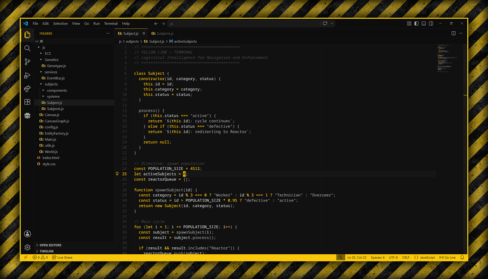

# YELLOW LINE Theme

**Under the ground, in a labyrinth of concrete corridors and steel floors, there is a world. There is no day or night, no wind, no sky. Only yellow lines on the floor and walls. They show where to go. They forbid where not to.**

A VS Code theme born from the Megastructure. Not a simple color palette — an interface for executing the OMEGA DIRECTIVE. The AI called LINE speaks through yellow warning tape. This theme brings her voice to your code.

## Included Themes
- **YELLOW LINE — Terminal** — The main interface of LINE herself. Dark concrete, steel syntax, and yellow directives cutting through the shadows.

## Palette — The Voice of LINE
| Color | HEX | Role |
| :--- | :--- | :--- |
| Concrete & Steel | `#111111`, `#a8a8a8` | The cold, dirty, eternal monolith |
| The Directive | `#fac80a` | Yellow warning lines. Orders, navigation, enforcement |
| Reactor's Wrath | `#ff4500` | Bio-mass disposal, punishment, critical errors |
| Whispers | `#4d4d4d` | Comments fade into the shadows |

## Installation
1. Download `yellow-line-theme-1.0.0.vsix` from [Releases](https://github.com/Dthwalker/yellow-line-theme/releases)
2. In VS Code: `Extensions` → `...` → `Install from VSIX...`
3. Select theme: `YELLOW LINE — Terminal`
4. Press `Ctrl+K Ctrl+T` → `YELLOW LINE — Terminal`

## Roadmap
- **Concrete** — Light theme. Bleached concrete under harsh lamps
- **Reactor** — Deep orange and red. The heart of bio-mass conversion
- **Overseer** — High contrast. The interface of the Watchers
- **Sublevel** — Even darker. Deeper levels, lost sectors

## License
MIT — DTHWalker, 2026

---

*The Directive told us to preserve humanity. This theme does the rest.*
*Follow the lines. Obey the markings. The cycle continues.*